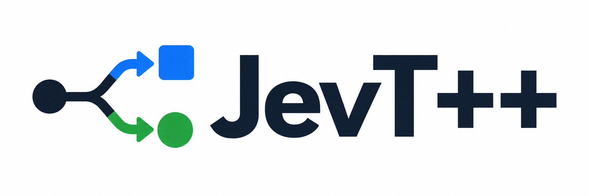

<p align="center">
  
</p>

<p align="center">
  <strong>Application context in. Typed decisions out.</strong><br>
  A C++20 library for typed model-backed routing, classification and scoring.
</p>

<p align="center">
  <a href="https://github.com/wiatrM/jevtpp/actions/workflows/ci.yml"></a>
  <a href="LICENSE"></a>
  
</p>

JevT++ turns runtime text, JSON or application objects into enums, boolean
decisions and scores your code can use directly. Define the available answers
and their meaning once; supply new context on every call. Optional Laya
backends run inference inside your process with ONNX Runtime or native ggml.
An opt-in remote backend uses the same typed API with hosted inference.

- **Typed vocabulary:** compile-time schemas, enum rubrics and explicit abstention.
- **Shared context:** evaluate several independent fields in one Laya batch.
- **Inspectable answers:** full distributions, P(true), fractional scores and confidence.
- **Observable runtime:** latency percentiles, JSON/Prometheus metrics and an optional loopback dashboard.
- **Small core:** no Python runtime, JSON library or ONNX dependency unless you enable the adapter.

[Documentation](https://wiatrm.github.io/jevtpp/) · [Quick start](#build-and-test) · [System One API](docs/SYSTEM_ONE.md) ·
[ONNX setup](docs/LAYA.md) · [Native CPU/CUDA](docs/NATIVE.md) · [Remote](docs/REMOTE.md) · [Performance](docs/PERFORMANCE.md) ·
[Runnable demo](examples/laya_routing_demo.cpp)

## Runtime-configured decision graphs

The optional [decision graph](docs/DECISION_GRAPHS.md) composes dependent
observations, judgments and action proposals with explicit snapshot provenance.
The [skill arbiter and operator registry](docs/SKILLS.md) can validate and load
a versioned JSON graph at runtime without recompiling C++; operator
implementations are still compiled, trusted C++ callbacks. The
[warehouse and routing configurations](examples/skills/) run through one
[C++ demo](examples/skill_runtime_demo.cpp). These primitives do not train a
policy or guarantee safe actions: domain adapters must verify observations,
constraints and outcomes. The [NES Mario research demo](examples/mario_dashboard/README.md)
uses them with local CUDA inference but has **not** cleared the full game.

JevT++ is an independent open-source library. It is not the proprietary Jev
model or an official TypeSafe SDK. The bundled adapter runs Laya; model quality
depends on its weights and your task.

## One context, several typed answers

```cpp
#include <jevt/system_one.hpp>
#include <jevt/laya.hpp>

enum class Category { billing, technical, sales, spam };
enum class Urgency { low = 0, medium = 1, high = 2 };

constexpr auto categories = jevt::schema<Category, "support.categories">(
    jevt::option<Category::billing>("Invoices, payments, or refund requests."),
    jevt::option<Category::technical>("Software bugs, crashes, or login failures."),
    jevt::option<Category::sales>("Upgrades, enterprise pricing, or new purchases."),
    jevt::option<Category::spam>("Unsolicited marketing or automated noise."));
constexpr auto urgency = jevt::schema<Urgency, "support.urgency">(
    jevt::option<Urgency::low>("Customer is patient and calm."),
    jevt::option<Urgency::medium>("Issue blocks work but has a workaround."),
    jevt::option<Urgency::high>("Complete outage or severe frustration."));

constexpr auto ticket = jevt::decision_model<"support.ticket">(
    "Evaluate the incoming customer support ticket.",
    jevt::choice<"category">("Which team should own this request?", categories, 0.4F),
    jevt::noul<"is_urgent">("Does this require attention within one hour?", {0.2F, 0.8F}),
    jevt::score<"urgency_score">("Rate the frustration level against the rubric.", urgency),
    jevt::probability<"sentiment_probability">("The customer is angry."));

int main() {
    auto model = jevt::models::laya_multilingual("models/laya-multilingual");
    auto brain = jevt::bind_system_one(ticket, model);
    auto answer = brain.evaluate(jevt::json_state(R"({
        "ticket": {"body": "Nobody can log in. Our entire team is blocked."},
        "customer": {"plan": "enterprise", "active_users": 120},
        "context": {"workaround_available": false, "sla_minutes": 60}
    })"));

    if (!answer) return 1;             // Technical failure.
    if (answer->abstained()) return 2; // Application can request human review.
    Category owner = answer->get<"category">().value();
    bool urgent = answer->get<"is_urgent">().value();
    Urgency level = answer->get<"urgency_score">().value();
    float expected_level = answer->get<"urgency_score">().score();
    float angry = answer->get<"sentiment_probability">().value();
}
```

The input is owned once and shared across the questions. For an application
object, use `brain.evaluate(record, serializer)` with a serializer returning
`jevt::json_state(...)` or `jevt::text_state(...)`; it runs once per evaluation.
An ADL `to_jevt_state(const Record&)` customization is also supported. No JSON
library is required by the core, and JSON syntax validation belongs to your
serializer. The optional remote module parses structured payloads before sending them.

| Field | Result | Example |
|---|---|---|
| `choice` | Enum, full distribution, entropy confidence | Which team owns this ticket? |
| `noul` | True / false / abstain, with P(true) | Does it need attention within an hour? |
| `score` | Modal enum and expected rubric position | Low / medium / high, with a fractional score |
| `probability` | P(true) for a proposition | The customer is angry. |

Questions are independent: an answer to one field is not fed into another.
`probability` evaluates a proposition; it does not extract arbitrary numbers.
Confidence expresses concentration of the distribution, not measured accuracy.

See [System One API and serializers](docs/SYSTEM_ONE.md),
[the runnable Laya demo](examples/laya_routing_demo.cpp), and
[native inference setup](docs/LAYA.md).

## Runtime input, compile-time vocabulary

`constexpr` describes the output schema. Input arrives at runtime from your
HTTP handler, queue, file or application state. A single-decision binding can
be reused for each request:

```cpp
auto app = jevt::init({.inference_backend = backend});
auto routing = jevt::bind(categories, {.question = "Which team owns this ticket?"});
std::string message = "Card charged twice; please refund it";
auto result = routing.choose(message);  // message can change on every call
```

The runtime also binds multi-field models with `jevt::bind_system_one(ticket)`
and records one diagnostic call per evaluation. Direct binding with
`bind_system_one(ticket, backend)` is available without global initialization.
Custom backends can implement `predict_batch()`; its default implementation
calls `predict()` sequentially.

See the [complete routing example](examples/support_routing.cpp) for error,
abstention and exhaustive typed dispatch handling.

## Where JevT++ fits

| Project | Execution | What it offers |
|---|---|---|
| **JevT++** | In-process ONNX/ggml CPU or CUDA; optional remote HTTP | Compile-time enum schemas, typed field access, bounded batching, abstention and diagnostics |
| [Laya Python](https://github.com/NandhaKishorM/laya) | Local model runtime with CPU/GPU paths | Upstream model tooling and Python integration |
| [Receptron Laya](https://github.com/receptron/laya) | Node.js/TypeScript + ONNX Runtime | Typed System One calls in JavaScript applications |
| [laya.cpp](https://github.com/lkarlslund/laya.cpp) | Native C++ with ggml, CUDA/Vulkan/Core ML | Hardware-specific inference, CLI and Jev-compatible serving |
| [TypeSafe Jev](https://docs.typesafe.ai/introduction) | Hosted proprietary model | Managed inference through a typed decision API |

Choose JevT++ when decisions belong inside an existing C++ application and
you want local inference with application-owned types. Current `main` supports
CPU/CUDA selection and an optional [hosted backend](docs/REMOTE.md).
Using C++ alone does not make the same ONNX model faster than Python: the
native inference engine does most of the work in both cases.

`choose_async()` remains a `std::async` convenience. The optional
[batching backend](docs/BATCHING.md) adds bounded workers, microbatching and
owned future submission. The optional [Boost.Asio adapter](docs/ASIO.md) supports
completion tokens and `co_await`; request deadlines and stop tokens are checked
by the queue and supported transports. They cannot interrupt arbitrary running
local inference. [Scripted test backends](docs/TESTING.md) exercise application
behavior without model downloads or paid API calls.

## Performance

The original demo's approximately **567 ms** was a single four-field CPU call,
excluding model loading. It was not a warmed p50 or p95. Our paired benchmark
measures first-call latency separately, warms the model, and compares C++ with
Python using identical inputs, weights and ONNX Runtime versions.

Local i7-10700K CPU, default ORT threads, 30 warmed requests:

| Implementation | 1 field p50 / p95 | 4 fields p50 / p95 |
|---|---:|---:|
| JevT++ / ONNX Runtime | 139 / 151 ms | 565 / 605 ms |
| Paired Python / ONNX Runtime | 138 / 145 ms | 584 / 631 ms |

These shared-workstation measurements show similar inference latency, not a
general C++ speed advantage. The current CPU path does not meet a sub-100 ms
target on this workload.

A separate **Python + CUDA experiment** on an RTX 4090 reached **14.1 ms p50 /
15.7 ms p95** for the same four-field fixture. This shows GPU headroom, **not
GPU support in the released v0.2.0 adapter**. Current `main` now includes native
C++ CUDA selection, warmup, bounded batching and cache/buffer controls. See the report for numerical parity
and hardware/runtime details; this is not a quality comparison with Jev.

The optional [native laya.cpp/ggml backend](docs/NATIVE.md) now provides another
path. In a matched RTX 4090 run (100 warmed pairs, full JSON/four fields), ONNX
measured **10.83 / 12.94 ms p50/p95**, versus native optimized FP32 at
**5.89 / 7.75 ms**. All eight short/long, one/four-field cases passed a `1e-4`
probability and exact-argmax gate. These are local repeated-input measurements,
not a best-in-class or production-latency guarantee. Full samples and the
reproduction command are in the performance report below.

See [measurements, methodology and reproduction](docs/PERFORMANCE.md) for the
local results and separately attributed Jev/GPU measurements. The keyword
backend benchmark measures library overhead; it does not measure Laya speed.

## Build and test

Requirements are a C++20 compiler, CMake 3.24+ and Ninja (recommended).

```sh
cmake -S . -B build -G Ninja \
  -DCMAKE_BUILD_TYPE=Release \
  -DJEVT_BUILD_TESTS=ON \
  -DJEVT_BUILD_EXAMPLES=ON
cmake --build build
ctest --test-dir build --output-on-failure
```

Build the performance suite separately so benchmark flags do not affect the
library used by tests:

```sh
cmake -S . -B build-bench -G Ninja \
  -DCMAKE_BUILD_TYPE=Release \
  -DJEVT_BUILD_BENCHMARKS=ON
cmake --build build-bench
ctest --test-dir build-bench -L benchmark-smoke --output-on-failure
```

Useful options:

| Option | Default | Purpose |
|---|---:|---|
| `JEVT_BUILD_TESTS` | Top-level only | Acceptance and unit tests |
| `JEVT_BUILD_EXAMPLES` | Top-level only | Runnable examples |
| `JEVT_BUILD_BENCHMARKS` | Top-level only | Benchmarks and load scenarios |
| `JEVT_ENABLE_HTTP` | `ON` | Optional HTTP diagnostics service |
| `JEVT_ENABLE_LAYA` | `OFF` | Native Laya inference with ONNX Runtime |
| `JEVT_ENABLE_LAYA_NATIVE` | `OFF` | Safetensors/ggml native inference |
| `JEVT_ENABLE_REMOTE` | `OFF` | Hosted HTTP backend, `jevt::remote` |
| `JEVT_REMOTE_CURL` | `ON` when remote is enabled | Default libcurl transport; disable to inject your own |
| `JEVT_ENABLE_ASIO` | `OFF` | Boost 1.74+ integration, `jevt::asio` |
| `JEVT_FETCH_TOKENIZERS_CPP` | `ON` | Fetch pinned tokenizer dependency when building Laya |

To run the real multilingual model, fetch the pinned bundle and build the
optional adapter (C++20, Rust/Cargo and an ONNX Runtime SDK are required):

```sh
python3 scripts/fetch_laya.py models/laya-multilingual
cmake -S . -B build-laya -G Ninja \
  -DCMAKE_BUILD_TYPE=Release \
  -DJEVT_ENABLE_LAYA=ON \
  -DONNXRUNTIME_ROOT=/path/to/onnxruntime-sdk
cmake --build build-laya
./build-laya/examples/jevt_laya_demo models/laya-multilingual
```

See [Laya setup and operating limits](docs/LAYA.md) for shared-library loading,
model provenance, token budgets and integration testing.

## Consume with CMake

Install and use the exported target:

```sh
cmake --install build --prefix "$HOME/.local"
```

```cmake
find_package(jevtpp CONFIG REQUIRED)
target_link_libraries(my_service PRIVATE jevt::jevt)
target_compile_features(my_service PRIVATE cxx_std_20)
```

The package is relocatable; consumers do not need to copy headers or depend
on the JevT++ source tree.

Embedding a checkout also works:

```cmake
add_subdirectory(external/jevtpp)
target_link_libraries(my_service PRIVATE jevt::jevt)
```

When embedded with `add_subdirectory()` or `FetchContent`, tests, examples and
benchmarks default to `OFF`. Explicit `JEVT_BUILD_*` settings are preserved.
Optional integrations remain opt-in; link `jevt::remote` or `jevt::asio` only
when that module was enabled in the library build.

### Conan 2

```sh
conan profile detect --force
conan create . --build=missing
# Optional dashboard:
conan create . -o jevtpp/*:dashboard=True --build=missing
```

The recipe also works as a local editable/package dependency. It exports the
same `jevt::jevt` CMake target.

### vcpkg manifest mode

```sh
cmake -S . -B build -G Ninja \
  -DCMAKE_TOOLCHAIN_FILE="$VCPKG_ROOT/scripts/buildsystems/vcpkg.cmake"
cmake --build build
```

Select optional manifest features with `VCPKG_MANIFEST_FEATURES=dashboard`.
The core package has no ONNX dependency. Build the optional `jevt::laya` target
from source using [the Laya instructions](docs/LAYA.md); the Conan and vcpkg
recipes currently cover the core and dashboard.

## Diagnostics and HTTP dashboard

Diagnostics are a library API first. Callers can obtain a consistent snapshot
containing request counts, outcome counters and latency percentiles such
as p50, p95 and p99. Metrics are grouped by the stable schema identifier, not
by raw user input, which avoids unbounded labels and accidental sensitive-data
exposure.

The optional dashboard is a thin read-only adapter over those snapshots. It
exposes JSON at `/api/stats`, Prometheus text at `/metrics`, health at
`/healthz`, and an HTML view at `/`. Starting is explicit and the server binds
to loopback by default. Raw inputs and model payloads are not retained.

See [observability and dashboard operations](docs/OBSERVABILITY.md) for the
metric model, endpoint contract and production guidance.

## Design principles

- The type system owns the decision vocabulary; a backend only supplies
  scores or outcomes.
- A stable schema identifier makes diagnostics, policies and model rollout
  auditable.
- Configuration precedence is local binding, then context, then library
  defaults. Existing bindings never change implicitly.
- A technical error, an abstention and a valid negative result are different
  states.
- Model execution is replaceable. The core does not require ONNX, HTTP or a
  specific model family.

More detail is in [docs/ARCHITECTURE.md](docs/ARCHITECTURE.md). JevT++ is
available under the [MIT License](LICENSE).

